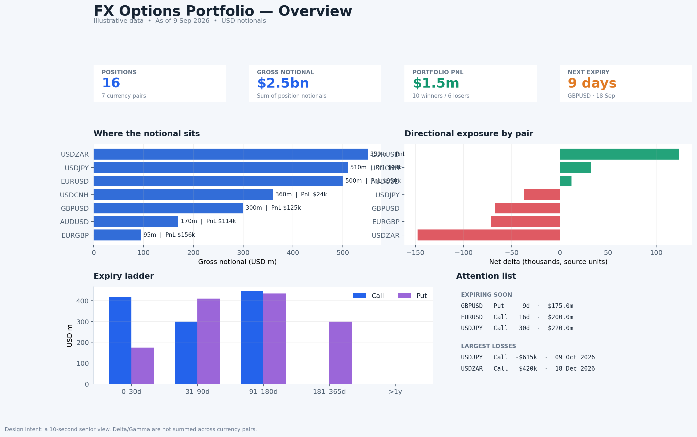
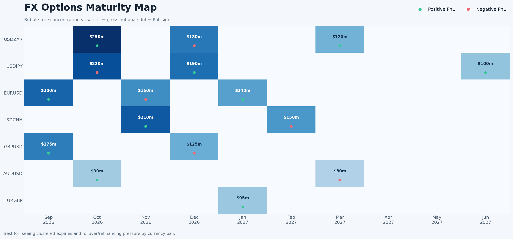
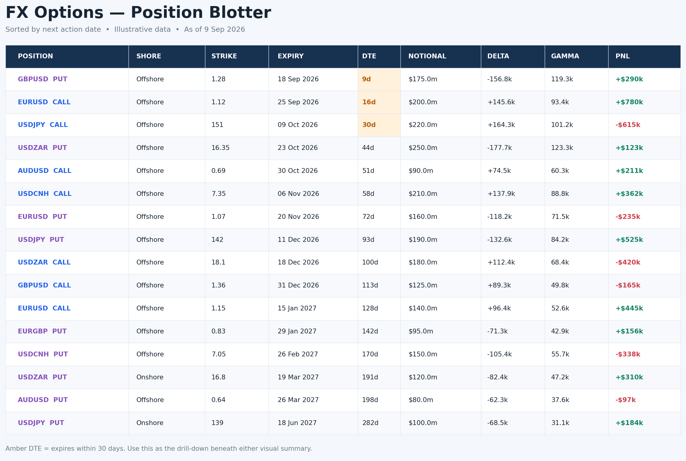

# FX option portfolio presentation options

Illustrative data as of 9 September 2026. All sample notionals use USD. Delta and Gamma remain in the source units and are only aggregated within each underlying.

## Option 1 — Overview dashboard

Use this as the first page for management, trading, or risk. It answers four questions quickly: how large is the portfolio, where is it concentrated, what is the directional exposure by pair, and what needs attention soon?

## Option 2 — Maturity heatmap

Use this for daily risk and roll planning. Rows are currency pairs, columns are expiry months, cell intensity is gross notional, and the dot shows whether aggregate PnL in that cell is positive or negative.

## Option 3 — Position blotter

Use this as the supporting detail page. It is sorted by days to expiry, highlights positions expiring within 30 days, and uses color only where it carries meaning.

## Recommended package

Use Option 1 as page one and Option 3 as page two. Add Option 2 when expiry clustering and roll planning are central to the conversation.

Before applying the design to live holdings, settle two data rules:

1. Convert notionals and PnL to one reporting currency using an agreed FX snapshot, while retaining their original currency values.
2. Define the units of Delta and Gamma. Cross-pair portfolio totals should only be shown after converting the Greeks to a common risk measure, such as USD PnL for a 1% spot move.
